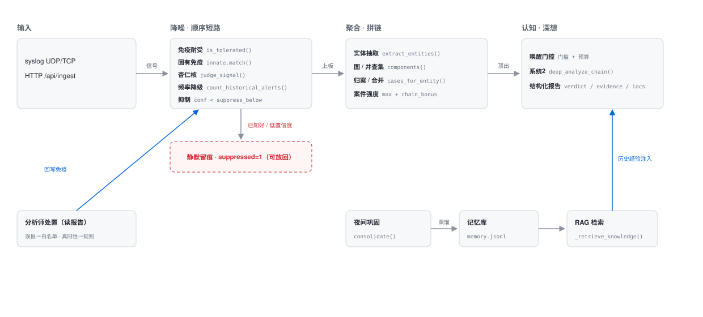

# 降噪与聚合：技术设计

> 从代码与算法角度记录两条主线的实现。所有片段引自仓库源码（`prototype/` + `backend/`），
> 可按文件路径核对。架构图为手绘 SVG（`architecture.svg`），随文档一起入库。

---

## 1. 整体架构



> 主线：输入 → 降噪（顺序短路）→ 聚合（拼链）→ 顶出 → 系统2 深想 → 报告。
> 两条闭环：分析师读报告后回写免疫（左下蓝线）、夜间巩固蒸馏记忆经 RAG 注入系统2（右下蓝线）。
> 降噪四道闸门任一命中即「静默留痕」（红框），不往后调用更贵的计算。

**模块 ↔ 文件 ↔ 关键函数**

| 层 | 文件 | 关键函数 / 类 |
|---|---|---|
| 输入 | `backend/syslog_server.py` | `start()` → 逐条 `pipeline.process_signal` |
| 输入 | `backend/api/dashboard.py` | `POST /api/ingest` → `pipeline.process_signal` |
| 降噪 | `prototype/signature.py` | `signature(source, type_, raw, asset="")` |
| 降噪 | `prototype/tolerance.py` | `load_tolerance / is_tolerated / learn` |
| 降噪 | `prototype/innate.py` | `load_rules / match / add` |
| 降噪 | `prototype/amygdala.py` | `judge_signal / _extract_json` |
| 聚合 | `prototype/artifact.py` | `extract_entities` |
| 聚合 | `prototype/graph.py` | `Graph.add_signal / components / component_id` |
| 认知 | `prototype/system2.py` | `deep_analyze_chain` |
| 记忆 | `backend/nightly.py` | `consolidate` |
| 编排 | `backend/pipeline.py` | `process / process_signal / restore_signal` |

---

## 2. 降噪

降噪是**四道顺序短路的闸门**，命中即终止（静默留痕），不再往后调用更贵的计算。
所有闸门共享一个「签名」原语。

### 2.1 信号签名：变量掩码

`prototype/signature.py` 把一条告警的「形状」抽成稳定字符串，供免疫层做精确匹配：

```python
_IP   = re.compile(r"\b(?:\d{1,3}\.){3}\d{1,3}\b")
_HASH = re.compile(r"\b[0-9a-fA-F]{32}\b|\b[0-9a-fA-F]{40}\b|\b[0-9a-fA-F]{64}\b")
_IPV6 = re.compile(r"...")      # 含 :: 压缩 + 无压缩两种形式
_UUID = re.compile(r"...8-4-4-4-12...")
_NUM  = re.compile(r"(?<![\w-])\d+(?:\.\d+)?")

def signature(source, type_, raw, asset=""):
    s = _IP.sub("<IP>", raw or "")
    s = _HASH.sub("<HASH>", s)
    s = _IPV6.sub("<IP>", s)
    s = _UUID.sub("<UUID>", s)
    s = _NUM.sub("<NUM>", s)
    if asset and not _IDENT.search(s):   # raw 缺语义 token → 追加明文 asset 兜底
        return f"{source}|{type_}|{asset}|{s}"
    return f"{source}|{type_}|{s}"
```

要点：

- **变量掩码、常量保留**：把会变的 token（IP / 哈希 / 独立数字）替换成占位符，
  保留语义 token（主机名 / 账号 / 描述词）。这与日志模板抽取（Drain / Spell / LenMa）
  的「变量掩码 + 常量模板」同思路。
- **`_NUM` 的负向 lookbehind `(?<![\w-])`**：`web-01`、`redis-cache-02` 里连字符后的
  编号**不**被掩码（前面是 `-`），但 `port=80`、`bytes=4.2` 的独立数字会被掩码。
  这样「web-01 登录」和「web-02 登录」是两个签名，不会被误并成一个。
- 匹配是**精确字符串相等**（`set` 成员查询，O(1)），不引入相似度 / embedding。

### 2.2 免疫耐受：白名单集合

`prototype/tolerance.py`。数据结构是 `dict[str, {"created_at": ts}]`（带 TTL 到期），
持久化到 `data/tolerance.json`。

```python
def is_tolerated(signal, entries: dict, ttl_seconds: float = 0) -> bool:
    sig = signature(signal["source"], signal["type"], signal["raw"], signal["asset"])
    return sig in entries and (
        ttl_seconds <= 0 or time.time() - entries[sig]["created_at"] <= ttl_seconds
    )
```

- 命中且未过期 → `process_signal` 直接 `_suppress(...)`，**不调用任何模型**，落库 `suppressed=1`。
- 写入：分析师标「误报」时，`learn_signatures()` 把该案所有告警的签名并入，带 `created_at`。
- TTL 到期（默认 90 天，`tolerance_ttl_days` 可配，0=永久）自动失效重新研判，避免「永久静默」漏掉真实攻击。
- 只收签名字符串；旧格式 `[asset, type]` 在 `load_tolerance` 里被过滤（视为重置）。

### 2.3 固有免疫：规则集合

`prototype/innate.py`。与耐受**同一签名引擎、方向相反**：

```python
def match(signal, rules: set[str]) -> bool:
    return signature(signal["source"], signal["type"], signal["raw"], signal["asset"]) in rules
```

命中后构造 `Event(confidence=innate_conf=0.95, innate=True)` **直接上板**（进聚合），
跳过杏仁核与系统 2 的模型调用。规则只由分析师标「真阳性」写入；夜间巩固**不再**
自动蒸馏（见 §3.6），避免未确认的误报被永久写进「已知坏」。

### 2.4 杏仁核 + 抑制

`prototype/amygdala.py`。对既非已知好、也非已知坏的信号，用一个低参数高速模型判
「这段里有没有不该发生的」，产出结构化三件套：

```python
@dataclass
class Verdict:
    suspicious: bool
    confidence: float   # clamp 到 [0, 1]
    reason: str
```

`_extract_json()` 做容错解析：剥掉 markdown 代码围栏，取第一个 `{...}`。

抑制逻辑在 `backend/pipeline.py:process_signal`：

```python
v = amygdala.judge_signal(signal, client)
if v.confidence < knob.suppress_below:
    return _suppress(..., confidence=v.confidence)   # suppressed=1 落库，可放回
```

被抑制的信号**不删除**，完整落库并带 `why`，供 `restore_signal()` 放回。

### 2.5 频率降级

仅存在于**流式路径** `process_signal`（批量 `process` 没有这层）。针对「同一资产同一
类型反复告警」的业务噪声做一个频率先验：

```python
freq = state.get_freq_config()                    # {window:3600, threshold:10, demote:0.4}
hist = db.count_historical_alerts(signal["asset"], signal["type"], freq["window"])
if hist >= freq["threshold"]:
    v = Verdict(v.suspicious, round(v.confidence * freq["demote"], 2),
                f"{v.reason}（历史同类型告警 {hist} 次，疑似业务误报）")
    db.append_feedback({"type": "frequency_false_positive", ...})
```

置信度按 `demote` 折扣后再过一次抑制线，仍低则静默，够高则带折扣后的置信度上板。

### 2.6 系统 2 唤醒门控

`process_signal` 里，案件强度越过顶出线后，还要过两重门（`backend/pipeline.py`）：

```python
worthy = len(alerts) >= 2 or max_conf >= gating["single_signal_floor"]
report_exists = db.get_case_report(case_id) is not None
grew = len(alerts) - reported_at_alerts >= d["grew"]
if worthy and (not report_exists or grew):
    if _within_budget(knob.budget, gating["budget_window"]):
        _record_wake(case_id); ...  # 后台跑 system2
    else:
        db.insert_audit("budget_blocked", ...)
elif not worthy:
    db.insert_audit("single_signal_skipped", ...)
```

- **单信号门槛**：单条告警默认不醒（除非 `max_conf >= 0.98`），要等拼链或确凿单点 IOC。
- **预算门**：滑动窗口（默认 3600s）内最多唤醒 `budget` 个不同案件。`_woken_cases` 是
  进程内 `dict[case_id, last_wake]`，`_within_budget` 先淘汰过期条目再比较 `len < budget`。
- 被门拦下也写审计（`budget_blocked` / `single_signal_skipped`）——抑制不是静默。

---

## 3. 聚合

降噪解决「少看」，聚合解决「看什么」。单条告警信息量小，攻击是一串跨资产、跨时间的
动作，聚合把这串动作拼成「一个案件」。

### 3.1 实体抽取

`prototype/artifact.py`。正则启发式，从 `asset` + `raw` 正文抽实体：

```python
_IP     = re.compile(r"\b(?:\d{1,3}\.){3}\d{1,3}\b")
_HASH   = re.compile(r"\b[0-9a-fA-F]{32}\b|\b[0-9a-fA-F]{40}\b|\b[0-9a-fA-F]{64}\b")
_DOMAIN = re.compile(r"\b[\w-]+(?:\.[\w-]+)*\.(?:com|io|net|org|cn|cloud|local|lan|internal)\b", re.I)
_IDENT  = re.compile(r"\b[a-zA-Z]\w*(?:[_-][\w-]*)+\b")
```

归一化：`asset` 字段若整段匹配 IP 则归 `ip`，否则归 `asset`；正文里的标识符也归
`asset`。域名整段匹配（`mall-portal.example.com` 是一个节点，不拆成 `example.com`
+ `mall-portal`）。输出按 `(type, value)` 去重、保序。

### 3.2 图 + 连通分量（并查集）

`prototype/graph.py`。实体为点、共现为边：一条信号内的所有实体**两两连边**（团），
跨信号共享实体即传递连通。用并查集求连通分量：

```python
def components(self):
    parent = list(range(n)); rank = [0] * n
    def find(x):
        while parent[x] != x:
            parent[x] = parent[parent[x]]   # 路径压缩
            x = parent[x]
        return x
    def union(a, b):
        ra, rb = find(a), find(b)
        if ra == rb: return
        if rank[ra] < rank[rb]: ra, rb = rb, ra   # 按秩合并
        parent[rb] = ra
        if rank[ra] == rank[rb]: rank[ra] += 1
    for a, b in self.edges: union(a, b)
    ...
```

- 复杂度近似 O(α(n)) 每操作。
- `component_id()`：分量内实体键排序后 SHA1 前 12 位，作为案件的稳定
  `correlation_uid`——同分量的信号永远得到同一案件 ID：

```python
keys = sorted(f"{e.type}:{e.value}" for e in entities)
return hashlib.sha1(",".join(keys).encode("utf-8")).hexdigest()[:12]
```

### 3.3 流式归案与合并

`process_signal` 逐条入库时，用实体反查已有案件：

```
for ent in entities:
    for c in db.cases_for_entity(ent.type, ent.value):
        case_ids.add(c.id)
命中多个 → db.merge_case(cid, keep)   # 合并到最小 ID
命中一个 → 归入
零命中   → component_id 新建案件
```

`cases_for_entity` 通过 `alert_artifacts` 关联表反查「这个实体出现在哪些案件」。
合并用「最小 ID 保留」策略，避免流式场景下同一攻击链被拆成多案。

### 3.4 案件强度

单条置信度是「这条有多不对劲」，案件强度体现「这一串有多可疑」：

```python
def strength(idxs):
    confs = [events[i].confidence for i in idxs]
    return max(confs) + min(chain_cap, chain_bonus * (len(idxs) - 1))
```

默认 `chain_bonus=0.10`、`chain_cap=0.30`。一条 conf=0.7 的告警单独成案强度 0.7；
三条约 0.7 的告警拼链强度 = 0.7 + 0.2 = 0.9。**链加成封顶**，避免无脑堆叠。

### 3.5 系统 2 结构化调查

`prototype/system2.py`。对「一个案件」做结构化调查，严格 JSON 输出：

```json
{ "verdict": "True Positive | Suspicious | False Positive | Benign | Insufficient Data",
  "confidence": "High | Medium | Low",
  "digest": "...", "evidence": [{"fact","conclusion"}],
  "attack_chain": [{"phase","description"}], "iocs": [{"value","context"}],
  "remediations": ["..."], "unknowns": ["..."] }
```

prompt 内嵌反幻觉纪律：只用输入事实、区分「已观察/推论/未确认」、证据不足就降
confidence 并写 `unknowns`、列表宁可空不凑数。`_run_system2` 用 per-case 锁串行化，
避免「证据少后写完覆盖证据全」的竞态。

### 3.6 记忆巩固与 RAG

- **巩固**（`backend/nightly.py:consolidate`）：定时（默认 6h）把 SQLite 里的案件用
  高智商推理模型蒸馏成 `{summary, ttps, false_positives}`，追加到 `memory.jsonl`。
- **RAG**（`backend/pipeline.py:_retrieve_knowledge`）：系统 2 调查前，按案件实体值
  反查 `feedback` 与 `memory`，把命中的历史经验作为参考注入 prompt。当前是**字符串
  包含匹配**，未向量化：

```python
if any(v in vals for v in entity_values):      # 反馈按实体值
    knowledge.append(f"...")
if text and any(v in text for v in entity_values):  # 记忆按文本包含
    knowledge.append(f"...")
```

---

## 4. 设计取舍

| 选择 | 替代方案 | 依据 |
|---|---|---|
| 签名精确匹配 | `(asset, type)` 粗匹配 | 粗匹配会「一刀切」静默整台机器；签名保留语义 token，同资产不同目标可区分 |
| 签名精确匹配 | 相似度 / embedding | 精确匹配零依赖、可解释、贴合现状；代价是变种会漏，相似度留作进阶 |
| 连通分量（并查集） | 同 asset 加权软提示 | 并查集是硬关联，可追溯「共享哪个实体」；软提示权重模糊、不可解释 |
| 分层路由（系统1/系统2） | 单模型全包 | 全量过强模型成本不可承受；分层让强模型只在拼链完成的少数案件上醒来 |
| 抑制留痕（suppressed=1） | 直接丢弃 | 留痕可审计、可 `restore_signal` 放回；丢弃会让误压的真攻击永久消失 |
| 频率降级打折而非硬拦 | 直接按频次静默 | 折扣保留「高置信度 + 高频」的边界情况，不因频率一票否决 |
| 固有免疫只由分析师回写 | 夜间自动蒸馏规则 | 自动蒸馏会把未确认的误报永久写进「已知坏」 |

---

## 5. 关键参数（默认值）

| 参数 | 默认 | 来源 | 作用 |
|---|---|---|---|
| `suppress_below` | 0.55（正常档） | `config.Knob` | 杏仁核抑制线 |
| `escalate_above` | 0.75（正常档） | `config.Knob` | 案件顶出线 |
| `budget` | 2（正常档） | `config.Knob` | 滑动窗口内系统 2 唤醒预算 |
| `chain_bonus` | 0.10 | `detection.json` | 每条额外告警抬升的强度 |
| `chain_cap` | 0.30 | `detection.json` | 链加成封顶 |
| `single_signal_floor` | 0.98 | `gating.json` | 单条告警单独唤醒的地板值 |
| `budget_window` | 3600s | `gating.json` | 预算滑动窗口 |
| `freq.window / threshold / demote` | 3600s / 10 / 0.4 | `freq.json` | 频率降级三参数 |
| `innate_conf` | 0.95 | `detection.json` | 固有免疫命中打上的置信度 |
| `grew` | 2 | `detection.json` | 案件新增 N 条告警才重分析 |
| `rag_limit` | 5 | `detection.json` | 注入 prompt 的历史经验条数上限 |

四档旋钮（`prototype/config.py`）：

| 档位 | suppress_below | escalate_above | budget |
|---|---|---|---|
| 宽松 | 0.75 | 0.85 | 1 |
| 正常 | 0.55 | 0.75 | 2 |
| 保守 | 0.40 | 0.62 | 3 |
| 战时 | 0.25 | 0.45 | 99 |

---

## 6. 已知限制

| 项 | 现状 | 影响 |
|---|---|---|
| 阈值未校准 | 0.55 / 0.75 按 mock 置信度手调 | 真模型置信度聚集在 0.7~0.95，需真实数据重新标定 |
| 实体抽取 | 正则启发式 | 够 demo；生产应由各告警源 Module 精确解析 |
| 签名匹配 | 精确相等，无相似度 | 同族变种会漏 |
| 记忆库 | `memory.jsonl` 字符串包含匹配 | 无语义检索，RAG 精度有限 |
| 预算计数 | 进程内 `dict`，重启归零 | 跨重启预算不连续 |

---

## 附：入口与调用关系

| 入口 | 路径 | 调用 |
|---|---|---|
| `pipeline.process_signal(signal)` | 流式 | `syslog_server.py`、`kafka_consumer.py`、`api/ingest.py`（24h 主路径） |
| `pipeline.restore_signal(signal)` | 放回 | `api/dashboard.py`（被抑制信号放回） |

差异：批量 `process()` 与 CLI/文件上传已废除，系统只保留流式 `process_signal`（逐条增量 + 频率降级 + 出口IP降噪 + 归案/合并）。
